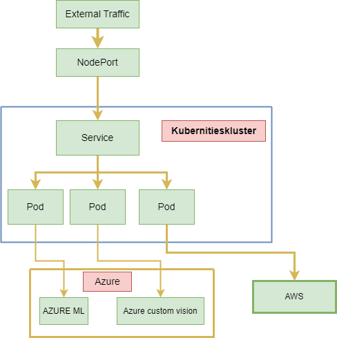

 # DESCRIPTION
#### This web application is powered by cloud-based AI and ML features using multi-cloud strategy. It has three basic functionalities. The first functionality predicts the page count of users favorite book, the second functionality recognizes few of the most natable characters from the famous fantasy trilogy called 'The lord of the rings', and the third functionality performs sentiment analysis from the text users enter or upload. Those functionalities existed in a single comprehensive application and follows microservice architecture pattern.

[Predicting page_count](docs/README1.md)  

[Recognizing characters](docs/README.md2)  

[Text analysis](docs/README.md3)

### ARCHITECTURE

  

### REQUIREMENTS TO DEPLOY
#### Deploying a web application to local kubernities cluster(minikube) requires to use Dockerfile, deployment.yaml file and if user wants best security practices they are supposed to secure their credentials using kubernities secret or other securing mechanism. Each will be outlined next its good to have a good understanding of minikube and kubectl at the begging of deploying this web applicaiton so usrs are adviced to have alook at the following links 
[Minikube](https://minikube.sigs.k8s.io/docs/start/)

[kubectl](https://kubernetes.io/docs/reference/kubectl/)

