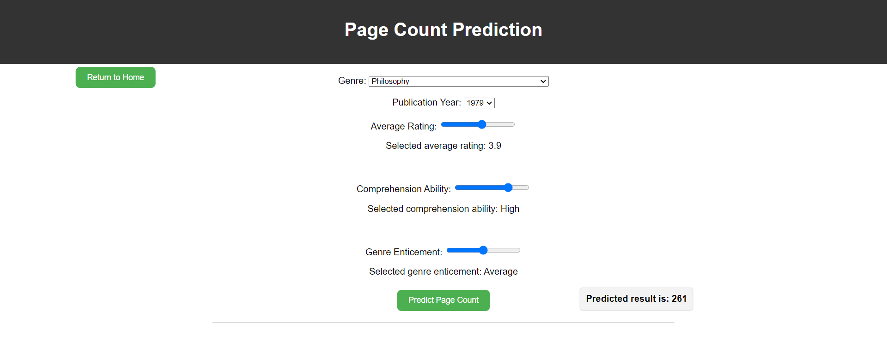

# The predict page 
#### This feature allows users to predict the page counte of a book based on its other attributes such as genre, page_number, average rating, comprehensionability and genre enticement. The ML model learnt the relationship that existed between those key attributes and predict the page count of the book with 86% accuracy. The layout is seen in the image below with sample input.

  

The sample shown above demonestrate how to interact with the machine learning model trained on those key attributes to predict the page count of a book. 
Users are allowed to choose the genre of the book from the drop down list, choose publication_year, 
