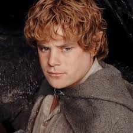

## CHARACTER RECOGNITION

#### Recognizing few of the most notable characters from the fantacy trilogy of the movie "The lord of the rings" involve collecting, processing and training the custom vision
using images of the characters the characters shall have enough set of images to acuquire enough set of images to identify suble differences. The format of the images can be 
either of JPG, JPEG, PNG or other format the custom model accepts. here is a sample of the image format.

  

