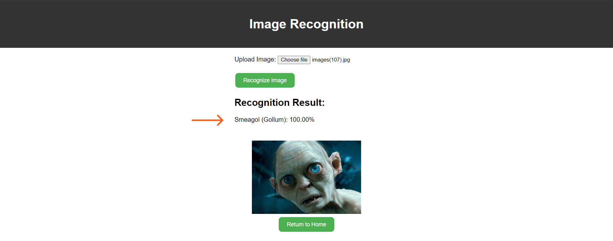

## CHARACTER RECOGNITION

#### Recognizing notable characters from the fantasy trilogy "The Lord of the Rings" involves collecting, processing, and training a machine learning model using custom vision. The model uses images of the characters, which need to be diverse and numerous enough to identify subtle differences. The images can be in JPG, JPEG, PNG, or other formats accepted by the custom model. Here is a sample of the image format.

  

The character could be recognized 100%
