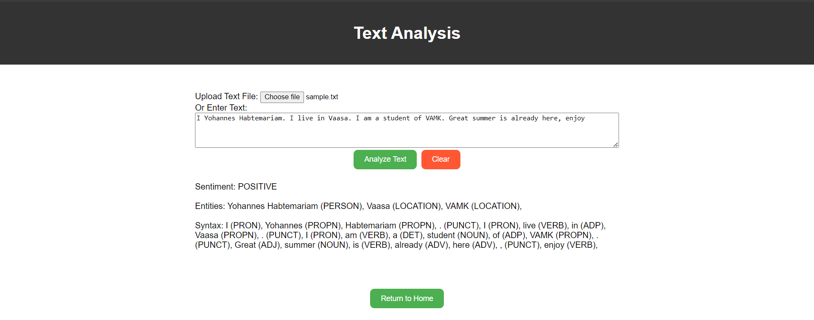

# Text analysis
#### The third feature involves analysing text written on the text box or uploaded. The features relies on AWS pre-trained comprehend features that will provide text analysis by providing entities that are described in the text, The sentiment of the text written or uploaded and the syntax of the text as shown in the following figure.

  

